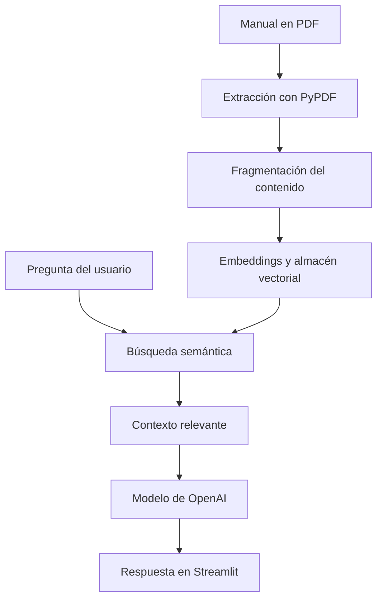

# 📄 FerAgent - Aprende Servicio al Cliente

<p align="center">
  <strong>Agente educativo con inteligencia artificial para consultar un manual de servicio al cliente mediante preguntas en lenguaje natural.</strong>
</p>

<p align="center">
  <a href="https://www.linkedin.com/in/ferchogarciadigital">
    
  </a>
</p>

<p align="center">
  
  
  
  
</p>

---

## 🚀 Prueba FerAgent en línea

<p align="center">
  <a href="http://139.177.101.130:8501">
    
  </a>
</p>

También puedes ingresar directamente desde:

**[http://139.177.101.130:8501](http://139.177.101.130:8501)**

> La aplicación está alojada en una instancia de Oracle Cloud Infrastructure. Si el enlace no responde, verifica que la instancia de OCI se encuentre encendida.

---

## 🎯 Descripción general

**FerAgent** es un agente educativo diseñado para aprender sobre servicio al cliente de manera práctica. Permite consultar en lenguaje natural el documento **“Manual Educativo: Las 100 Preguntas Más Frecuentes sobre Servicio al Cliente”**, sin recorrer manualmente sus 14 páginas.

El manual reúne 100 preguntas y respuestas distribuidas en ocho módulos:

1. Fundamentos del servicio al cliente.
2. Comunicación efectiva y empatía.
3. Manejo de clientes difíciles y conflictos.
4. Canales de atención y omnicanalidad.
5. Métricas, KPIs y calidad.
6. Procesos, protocolos y resolución de problemas.
7. Tecnología, inteligencia artificial y CRM.
8. Desarrollo profesional, actitud y bienestar.

FerAgent busca los fragmentos más relacionados con cada consulta y genera una respuesta clara basada únicamente en el manual. Cuando el documento no contiene la información solicitada, el agente lo indica en lugar de inventar una respuesta.

---

## 🧠 Arquitectura de la solución

FerAgent implementa una arquitectura **RAG** (*Retrieval-Augmented Generation* o generación aumentada por recuperación).



### Flujo de procesamiento

1. **Lectura:** PyPDF extrae el texto de cada página del manual.
2. **Fragmentación:** `RecursiveCharacterTextSplitter` divide el contenido en segmentos de 1,000 caracteres con 200 caracteres de superposición.
3. **Representación:** `text-embedding-3-small` convierte cada fragmento en un vector numérico.
4. **Almacenamiento:** `InMemoryVectorStore` conserva los vectores durante la ejecución.
5. **Recuperación:** el sistema selecciona los cuatro fragmentos más relacionados con la pregunta.
6. **Generación:** `gpt-4o-mini` redacta la respuesta utilizando únicamente el contexto recuperado.
7. **Presentación:** Streamlit muestra la conversación y las páginas consultadas.

---

## 🛠️ Tecnologías y herramientas

| Tecnología | Función |
|---|---|
| **Python 3.12** | Lenguaje principal del proyecto. |
| **Streamlit** | Interfaz web conversacional. |
| **PyPDF** | Extracción de texto y metadatos del PDF. |
| **LangChain Core** | Documentos, recuperación y almacén vectorial. |
| **LangChain Text Splitters** | División del manual en fragmentos. |
| **LangChain OpenAI** | Conexión con modelos y embeddings de OpenAI. |
| **OpenAI `gpt-4o-mini`** | Generación de respuestas. |
| **OpenAI `text-embedding-3-small`** | Búsqueda semántica dentro del manual. |
| **python-dotenv** | Lectura segura de la variable `OPENAI_API_KEY`. |
| **Git y GitHub** | Control de versiones y publicación del código. |
| **OCI Compute** | Alojamiento público de la aplicación. |
| **Ubuntu 24.04** | Sistema operativo de la instancia. |
| **systemd** | Ejecución permanente y reinicio automático de FerAgent. |
| **iptables** | Apertura y persistencia del puerto de Streamlit. |

---

## 📁 Estructura del proyecto

```text
FerAgent/
├── app.py
├── requirements.txt
├── README.md
├── .gitignore
├── .env.example
└── data/
    └── Manual_Servicio_Al_Cliente.pdf
```

> El archivo `.env` contiene la clave de OpenAI y nunca debe publicarse en GitHub.

---

## 💻 Ejecución local

### Requisitos

- Python 3.12 o compatible.
- Git.
- Una clave activa de la API de OpenAI.

### Instalación

```bash
git clone https://github.com/TU_USUARIO/FerAgent.git
cd FerAgent
python -m venv .venv
```

Activa el entorno virtual.

**Windows PowerShell**

```powershell
.venv\Scripts\Activate.ps1
```

**Linux o macOS**

```bash
source .venv/bin/activate
```

Instala las dependencias:

```bash
pip install --upgrade pip
pip install -r requirements.txt
```

Crea un archivo `.env`:

```text
OPENAI_API_KEY=coloca_aqui_tu_clave
```

Ejecuta la aplicación:

```bash
streamlit run app.py
```

Abre **[http://localhost:8501](http://localhost:8501)**.

---

## ☁️ Instalación y despliegue en OCI

### 1. Crear la red

Desde **Networking → Virtual Cloud Networks → Start VCN Wizard**:

1. Selecciona **Create VCN with Internet Connectivity**.
2. Crea una VCN, una subred pública y una subred privada.
3. Confirma que la subred pública utilice un Internet Gateway.

### 2. Crear la instancia

Desde **Compute → Instances → Create instance**:

- Sistema: **Canonical Ubuntu 24.04**.
- Tipo: **Virtual Machine**.
- Capacidad: **On-demand**.
- Shape recomendado: **VM.Standard.E5.Flex**, 1 OCPU y 6 GB de memoria, o una opción *Always Free* si existe capacidad.
- Red: selecciona la VCN creada.
- Subred: selecciona la subred pública.
- Activa **Automatically assign public IPv4 address**.
- Genera y descarga la clave SSH privada.

### 3. Abrir los puertos

En la lista de seguridad de la VCN agrega estas reglas de entrada:

| Protocolo | Puerto | Origen | Uso |
|---|---:|---|---|
| TCP | 22 | Tu dirección IP o `0.0.0.0/0` | Conexión SSH. |
| TCP | 8501 | `0.0.0.0/0` | Acceso público a Streamlit. |

> Para un entorno de producción, restringe SSH a una dirección IP autorizada y utiliza HTTPS mediante un proxy inverso.

### 4. Conectarse mediante SSH

Desde PowerShell:

```powershell
ssh -i "RUTA\A\TU\CLAVE.key" ubuntu@IP_PUBLICA
```

### 5. Preparar Ubuntu

```bash
sudo apt update
sudo apt install -y python3-venv python3-pip git iptables-persistent
```

### 6. Descargar e instalar FerAgent

```bash
git clone https://github.com/TU_USUARIO/FerAgent.git
cd FerAgent
python3 -m venv .venv
source .venv/bin/activate
pip install --upgrade pip
pip install -r requirements.txt
```

### 7. Configurar la clave de OpenAI

```bash
nano .env
```

Agrega:

```text
OPENAI_API_KEY=coloca_aqui_tu_clave
```

Guarda el archivo y protege sus permisos:

```bash
chmod 600 .env
```

### 8. Abrir el puerto en Ubuntu

```bash
sudo iptables -I INPUT 1 -p tcp --dport 8501 -m conntrack --ctstate NEW -j ACCEPT
sudo netfilter-persistent save
```

### 9. Probar Streamlit

```bash
streamlit run app.py --server.address 0.0.0.0 --server.port 8501
```

Abre:

```text
http://IP_PUBLICA:8501
```

### 10. Mantener FerAgent activo

Crea el servicio:

```bash
sudo nano /etc/systemd/system/feragent.service
```

Contenido:

```ini
[Unit]
Description=FerAgent Streamlit
After=network-online.target
Wants=network-online.target

[Service]
User=ubuntu
Group=ubuntu
WorkingDirectory=/home/ubuntu/FerAgent
EnvironmentFile=/home/ubuntu/FerAgent/.env
ExecStart=/home/ubuntu/FerAgent/.venv/bin/streamlit run /home/ubuntu/FerAgent/app.py --server.address=0.0.0.0 --server.port=8501 --server.headless=true
Restart=always
RestartSec=5

[Install]
WantedBy=multi-user.target
```

Activa el servicio:

```bash
sudo systemctl daemon-reload
sudo systemctl enable --now feragent
sudo systemctl status feragent
```

El estado esperado es:

```text
Active: active (running)
```

---

## 💬 Preguntas y respuestas de ejemplo

<details>
<summary><strong>1. ¿Qué es el servicio al cliente?</strong></summary>
<br>
Es el conjunto de estrategias, acciones y comportamientos que una organización utiliza para orientar, asistir y resolver las necesidades de sus usuarios antes, durante y después de adquirir un producto o servicio.
</details>

<details>
<summary><strong>2. ¿Cuáles son los tres pilares esenciales de un servicio de calidad?</strong></summary>
<br>
Los tres pilares son rapidez y eficiencia, para responder en tiempos razonables; precisión y efectividad, para solucionar correctamente desde el primer contacto; y calidez y empatía, para ofrecer un trato humano, respetuoso y personalizado.
</details>

<details>
<summary><strong>3. ¿Cómo se demuestra la escucha activa?</strong></summary>
<br>
Se demuestra sin interrumpir al cliente, formulando preguntas aclaratorias, registrando los detalles importantes y parafraseando lo expresado para confirmar que el problema fue comprendido correctamente.
</details>

<details>
<summary><strong>4. ¿Cuál es el primer paso ante un cliente furioso?</strong></summary>
<br>
El primer paso es mantener la calma, evitar tomar el enojo como un ataque personal y permitir que el cliente exprese su frustración sin interrumpirlo.
</details>

<details>
<summary><strong>5. ¿En qué consiste el método LAST para atender reclamos?</strong></summary>
<br>
LAST reúne cuatro acciones: escuchar atentamente, disculparse sinceramente por el inconveniente, resolver el problema con una solución clara y agradecer al cliente por informar lo ocurrido.
</details>

<details>
<summary><strong>6. ¿Cuál es la diferencia entre multicanalidad y omnicanalidad?</strong></summary>
<br>
La multicanalidad ofrece diferentes canales de contacto que operan de manera independiente. La omnicanalidad integra esos canales para que el cliente pueda cambiar de uno a otro sin repetir su información.
</details>

<details>
<summary><strong>7. ¿Cómo apoya la inteligencia artificial generativa a los agentes?</strong></summary>
<br>
Puede sugerir respuestas, redactar resúmenes automáticos de tickets complejos y traducir mensajes en tiempo real para facilitar la atención internacional.
</details>

---

## ⚠️ Consideraciones

- La aplicación responde únicamente con información contenida en el manual.
- El PDF debe conservar la ruta `data/Manual_Servicio_Al_Cliente.pdf`.
- La API de OpenAI genera costos según su uso.
- La clave `OPENAI_API_KEY` debe permanecer fuera de GitHub.
- El enlace público depende de que la instancia de OCI permanezca activa.

---

<p align="center">
  Desarrollado como proyecto final del <strong>Challenge Alura Agente</strong>.
</p>

---

## 🎥 Demostración en video

> Agrega aquí un video donde se muestre el funcionamiento de FerAgent, una consulta realizada y la respuesta generada desde OCI.

<center>https://github.com/user-attachments/assets/c8e17ca6-7b42-4daf-9cd4-aa579b685c88</center>


